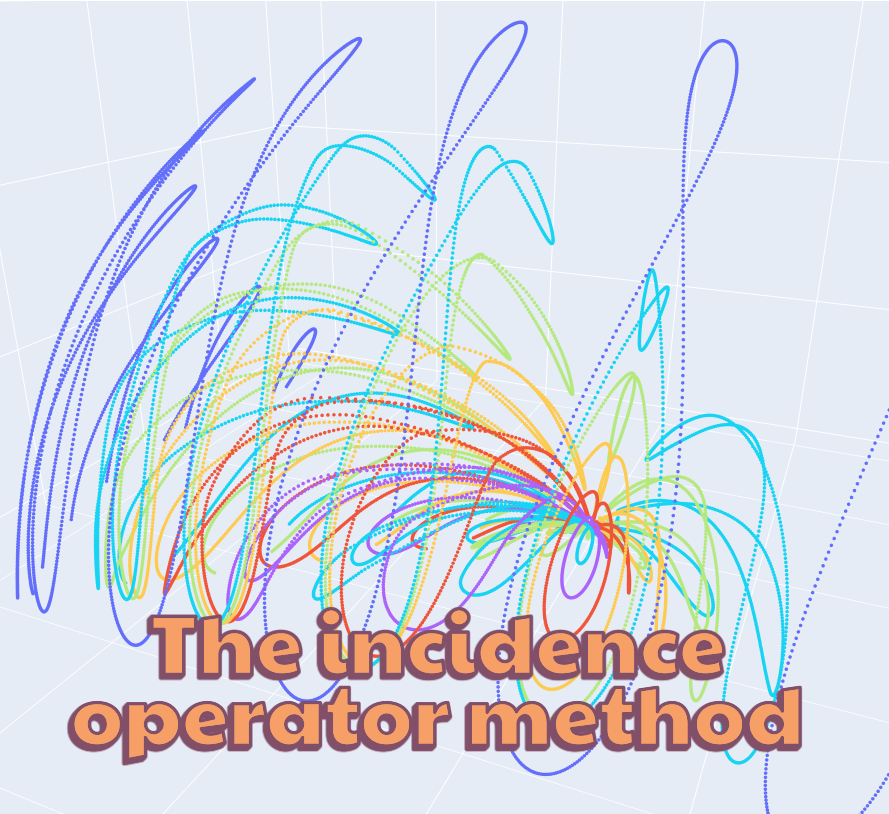

# The Incidence Operator Method: Surrogate Ray Tracing for Complex Adaptive Scenes



**Frequency:** Monthly

## Description

Are you working with a complex adaptive geometry, like a building skin, and unsure how to represent the influences of varying incidence directions and sky conditions in a dynamic simulation?

If so, I invite you to subscribe to the newsletter: *"The Incidence Operator Method: Surrogate Ray Tracing for Complex Adaptive Scenes"*.

With this newsletter I aim to inform interested engineers about the current procedure and possible applications of this new method.

---

## About Me

My name is **Simon Weber**, and I am a research assistant at the Institute for Acoustics and Building Physics at the University of Stuttgart, Germany. My primary research focus is the Incidence Operator Method and its application in enabling optimisation-based control of adaptive façades.

---

## What Are the Challenges?

1. To assess an adaptive scene, a control strategy is required.
2. Every scene is unique and project-specific.
3. Any change in material or geometric properties affects at least one optical quantity.
4. Optimisation-based control concepts (e.g., MPC, RLC) are necessary to account for multi-variate interactions and to incorporate changing boundary conditions, such as weather, occupancy or electricity price signals.

---

## What Are "Adjustable Material or Geometric Properties"?

| Type | Examples |
|------|----------|
| **Material** | Tint states of electrochromic or thermochromic windows |
| **Geometric** | Angles of moveable louvres, venetian blinds |

---

## Which Optical Quantities Are Considered?

- **Visual:** e.g. workplane illuminance, vertical eye illuminance
- **Broadband:** e.g. layer absorptance, transmittance, irradiance on PV surfaces
- **Other:** spectral sensitivities

---

## What Is the Incidence Operator Method?

A means to solve the challenges (adjustability, individuality, multivariability) by replacing ray-tracing simulations with **accurate, performant and exchangeable surrogate models**.

---

## Core Steps of the Incidence Operator Method

```
1.   Derive training data from parametric design
2.1  Train the core model (the incidence operator)
2.2  Derive integral quantity using a sky model
3.   Export the model for use by control engineers
...  coupling, control development, feedback, etc.
```

---

## Relevant Publications

1. Rüdisser, D., 2023. *RadiCal - A novel method to model energy flows induced by solar radiation* (PhD thesis). Graz University of Technology, Graz. [DOI](http://doi.org/10.13140/RG.2.2.35641.54882)

2. Weber, S.O., Fang, Y., Rüdisser, D., Leistner, P., 2024. *LiDICS: A light dynamics interface for multi-domain simulation based on the FMI-standard*. Journal of Building Performance Simulation. [DOI](http://doi.org/10.18419/opus-17315)

3. Weber, S.O., Subramaniam, S., Leistner, P., 2025. *A parametric design integrated sampling and general training approach for optimal control oriented surrogate models of light-related quantities*. Journal of Building Performance Simulation. [DOI](http://doi.org/10.18419/opus-17170)

---